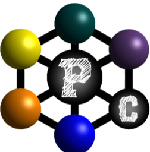

# ProChem

---

  

---

## Overview

ProChem is a tool designed to help researchers analyze and understand the results of complex quantum chemistry calculations. It provides a visual interface for processing data from various simulation packages, enabling better insights into molecular and material structures and properties.

<h1 align=\"center\"> Welcome to ProChem 👋 </h1>

ProChem is a program for reading and analyzing quantum chemistry calculations. It has a wide range of functions connected with visualization and processing results of VASP, QuantumEspresso, LAMMPS and other packages.

### 🏠 [Homepage](https://github.com/asolovykh/ProChem)

## Author

👤 **A.A. Solovykh**

* Website: https://github.com/asolovykh
* Github: [@asolovykh](https://github.com/asolovykh)

## Show your support

Give a ⭐️ if this project helped you!

## 📝 License

Copyright © 2025 [A.A. Solovykh](https://github.com/asolovykh). 
This project is [LGPL--3.0](https://github.com/asolovykh/ProChem) licensed.

